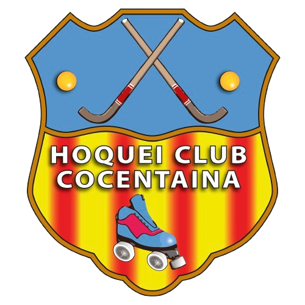

# 🏑 HCC App - Hoquei Club Cocentaina



[](https://github.com/Elebrimir/Hcc-app/actions/workflows/dart.yml)
[](https://github.com/Elebrimir/Hcc-app/actions/workflows/label.yml)
[](https://codecov.io/gh/Elebrimir/Hcc-app)

## 📱 Descripción

Aplicación oficial del Hoquei Club Cocentaina diseñada para facilitar la gestión y comunicación dentro del club. Esta aplicación permite a los usuarios mantenerse informados sobre eventos, partidos y noticias del club, además de proporcionar funcionalidades específicas según el rol del usuario.

## ✨ Características

- 🔐 **Autenticación de usuarios** - Registro y acceso con correo electrónico y contraseña
- 👤 **Perfiles de usuario** - Diferentes roles y permisos (jugadores, entrenadores, directivos)
- 📰 **Noticias y eventos** - Información actualizada sobre el club
- 🗓️ **Calendario de partidos** - Consulta de próximos enfrentamientos
- 📊 **Estadísticas** - Resultados y estadísticas de jugadores y equipos

## 🛠️ Tecnologías

- [Flutter](https://flutter.dev/) - Framework de UI para desarrollo multiplataforma
- [Firebase](https://firebase.google.com/) - Plataforma de desarrollo para apps
  - Authentication - Gestión de usuarios y accesos
  - Firestore - Base de datos NoSQL
  - Storage - Almacenamiento de imágenes y archivos

## 🚀 Instalación

```bash
# Clonar el repositorio
git clone https://github.com/Elebrimir/Hcc-app.git

# Navegar al directorio
cd hcc_app

# Instalar dependencias
flutter pub get

# Ejecutar la aplicación
flutter run
```

## 📁 Estructura del Proyecto

```
lib/
├── main.dart           # Punto de entrada de la aplicación
├── firebase_options.dart # Configuración de Firebase
├── models/             # Modelos de datos
│   └── user_model.dart # Modelo de usuario
├── pages/              # Páginas de la aplicación
│   ├── home_page.dart  # Página principal
│   ├── login_page.dart # Página de inicio de sesión
│   └── registration_page.dart # Página de registro
├── services/           # Servicios y lógica de negocio
└── widgets/            # Widgets reutilizables
```

## 🤝 Contribución

1. Haz un fork del proyecto
2. Crea una rama para tu feature (`git checkout -b feature/amazing-feature`)
3. Haz commit de tus cambios (`git commit -m 'Add some amazing feature'`)
4. Haz push a la rama (`git push origin feature/amazing-feature`)
5. Abre un Pull Request

## 📄 Licencia

Este proyecto está bajo la licencia [MIT](LICENSE).

## 📬 Contacto

Hoquei Club Cocentaina - [presidenciah.c.cocentaina@gmail.com](https://instagram.com/hoqueiclubcocentaina)

Enlace del proyecto: [https://github.com/Elebrimir/Hcc-app](https://github.com/Elebrimir/Hcc-app)
